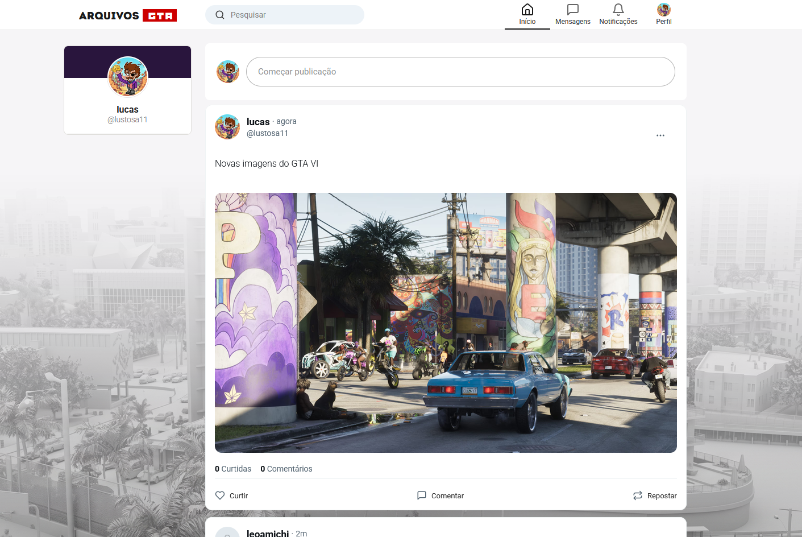
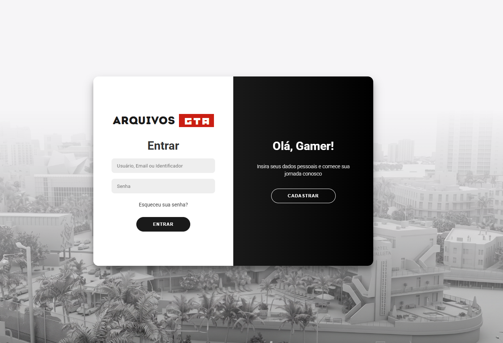
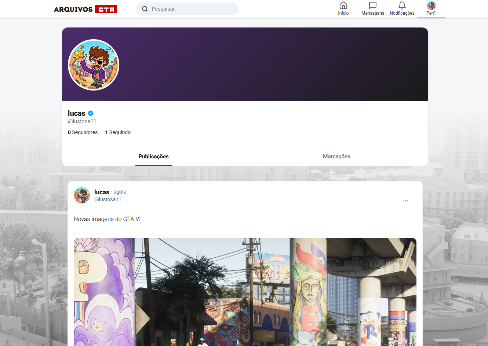

<p align="center">
  
</p>

<h1 align="center">ArquivosGTA — Comunidade</h1>

<p align="center">
  Plataforma completa de rede social e blog para entusiastas de GTA, com publicações, sistema de likes, seguidores e notificações em tempo real.
</p>

<p align="center">
  
  
  
  
  
</p>

---

## Sobre o Projeto

Minha jornada no desenvolvimento de software e criação de conteúdo começou no vibrante mundo de modding do **GTA San Andreas**. Com o tempo, decidi canalizar essa paixão para construir algo maior: uma plataforma moderna, robusta e interativa que servisse como uma verdadeira comunidade para entusiastas e criadores de conteúdo compartilharem suas criações, notícias e interações.

---

## Funcionalidades

- **Feed Interativo**: Publicações de posts com suporte completo a textos, imagens e vídeos.
- **Upload de Mídia**: Carregamento seguro de avatares, fotos de capa e mídias de postagens através de Multer.
- **Perfis Personalizados**: Customização de foto de perfil, foto de capa, bio e informações pessoais.
- **Sistema de Interações**: Curtidas em publicações em tempo real.
- **Rede de Contatos**: Sistema de seguir e parar de seguir outros usuários, com distinção visual de status.
- **Notificações**: Alertas em tempo real de novas interações (likes, seguidores).

---

## Segurança Avançada

O ArquivosGTA foi construído com as melhores práticas de proteção para garantir a integridade dos usuários e dos dados:

- **Autenticação Segura (JWT):** Utilização de JSON Web Tokens através de Cookies `HttpOnly` para evitar ataques de roubo de sessão.
- **Proteção Anti-CSRF (Double Submit):** Sistema robusto contra falsificação de requisições, validando `Headers` contra `Cookies`.
- **Anti-Replay e Nonce:** Requisições críticas usam `Nonce Tokens` descartáveis, impedindo ataques de repetição.
- **Circuit Breaker:** Consultas ao banco de dados são protegidas com a biblioteca `opossum`. Em caso de instabilidade no MySQL, o sistema corta a conexão rapidamente para evitar falhas em cascata.
- **Upload Blindado (Magic Bytes):** Arquivos maliciosos renomeados (ex: `.exe` para `.png`) são detectados e deletados na hora lendo os bytes puros do cabeçalho do arquivo via `file-type`.
- **Rate Limiting & HTTP Headers:** Proteção contra DDoS/Scraping com limites globais de acessos, além de blindagem contra XSS via `helmet` e sanitização de inputs com `express-validator`.

---

|  Login / Cadastro  |  Feed Principal  |  Perfil do Usuário  |
|:---:|:---:|:---:|
|  |  |  |

---

## Estrutura do Projeto

```
arquivosgta/
├── client/          # Aplicação frontend em React + Vite
│   ├── src/
│   │   ├── assets/  # Ícones e recursos visuais
│   │   ├── App.jsx  # Componentes e roteamento principal
│   │   └── main.jsx # Ponto de entrada da aplicação
│   └── package.json
├── server/          # Servidor backend Node.js + Express
│   ├── index.js     # Servidor e APIs principais (rotas, DB e uploads)
│   ├── uploads/     # Pasta local para imagens de perfis, capas e posts
│   ├── .env         # Configurações do banco de dados (Host, User, Pass)
│   └── package.json
└── README.md
```

---

## Instalação e Execução

### Pré-requisitos

| Ferramenta | Versão Mínima |
|:--|:--|
| [Node.js](https://nodejs.org/) | v18+ |
| [MySQL](https://dev.mysql.com/downloads/) | 8.0+ |

### Passo 1 — Configurar o Banco de Dados

1. Certifique-se de que o MySQL está rodando na sua máquina.
2. Crie o banco de dados principal:
```sql
CREATE DATABASE IF NOT EXISTS arquivosgta_db;
```
3. Caso suas credenciais locais do MySQL sejam diferentes do padrão, edite o arquivo [server/.env](server/.env):
```env
DB_HOST=localhost
DB_USER=root
DB_PASSWORD=
DB_NAME=arquivosgta_db
PORT=5001
```

### Passo 2 — Iniciar o Backend

```bash
cd server
npm install
node index.js
```
Você deverá ver a seguinte mensagem:
```
Server is running on port 5001
Database initialized successfully.
```

### Passo 3 — Iniciar o Frontend

Abra outro terminal e execute:

```bash
cd client
npm install
npm run dev
```
Você deverá ver:
```
➜  Local:   http://localhost:3000/
```

---

## Licença

Este projeto está licenciado sob a **GNU General Public License v3.0 (GPLv3)**. Veja o arquivo [LICENSE](LICENSE) para obter detalhes completos do licenciamento.

- **Copyleft Forte**: Qualquer derivado ou modificação deste projeto também deve ser distribuído abertamente sob a mesma licença GPLv3.
- **Atribuição**: Todos os clones e forks devem obrigatoriamente manter a autoria e os direitos do projeto original.
